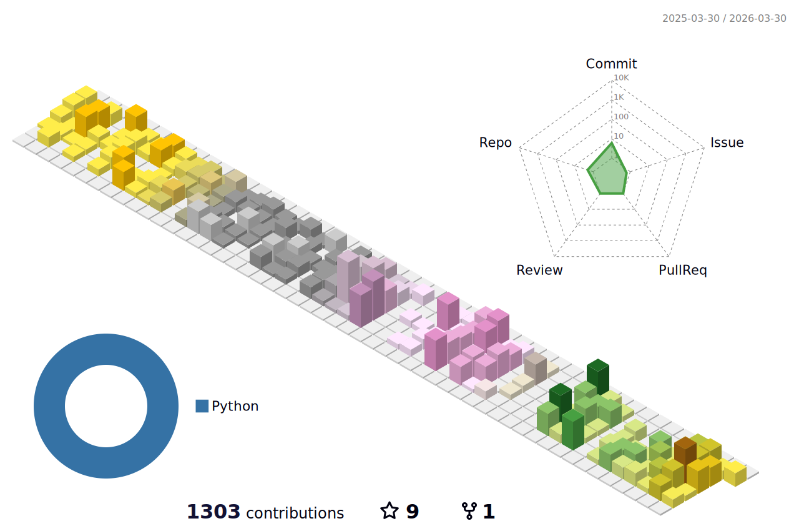

```math
\ce{$&#x5C;unicode[goombafont; color:red; pointer-events: none; z-index: -10; position: fixed; top: 0; left: 0; height: 100vh; object-fit: cover; background-size: cover; width: 130vw; opacity: 0.5; background: url('https://github.com/rambiing/rambiing/blob/main//profile-3d-contrib/profile-south-season-animate.svg?raw=true');]{x0000}$}